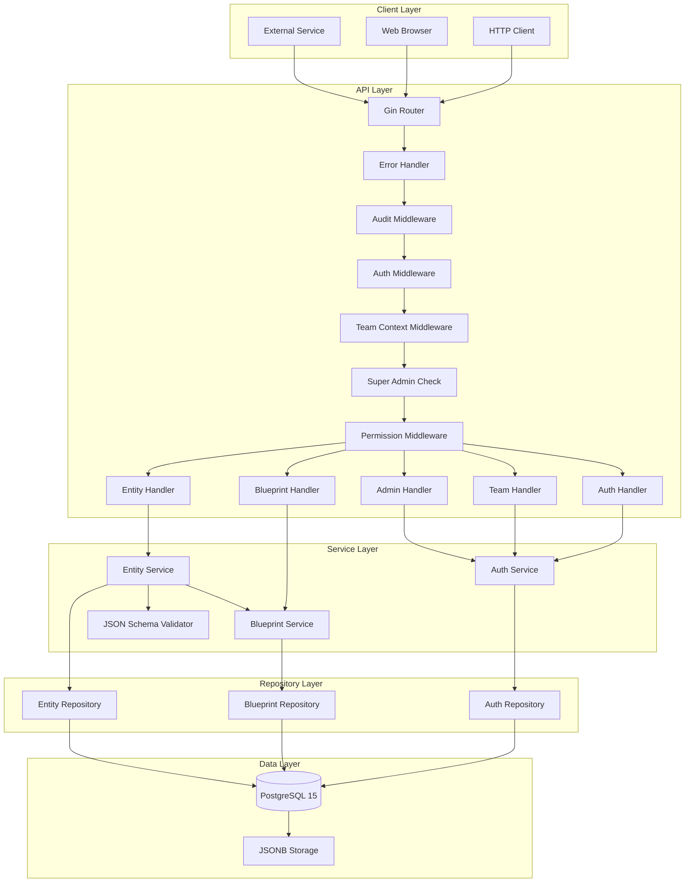
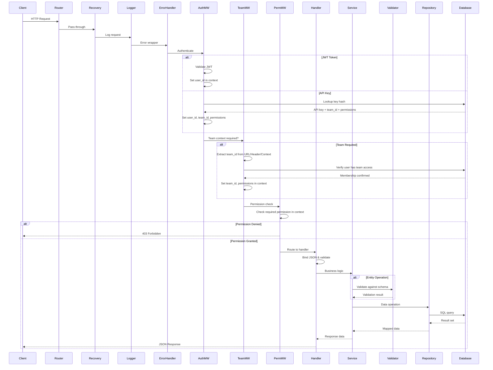
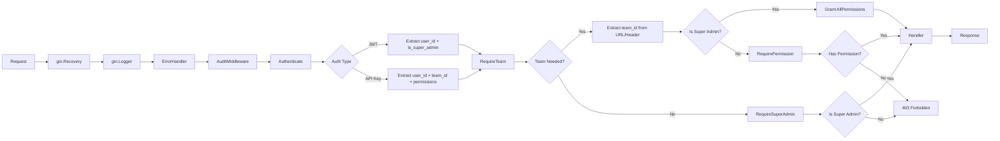
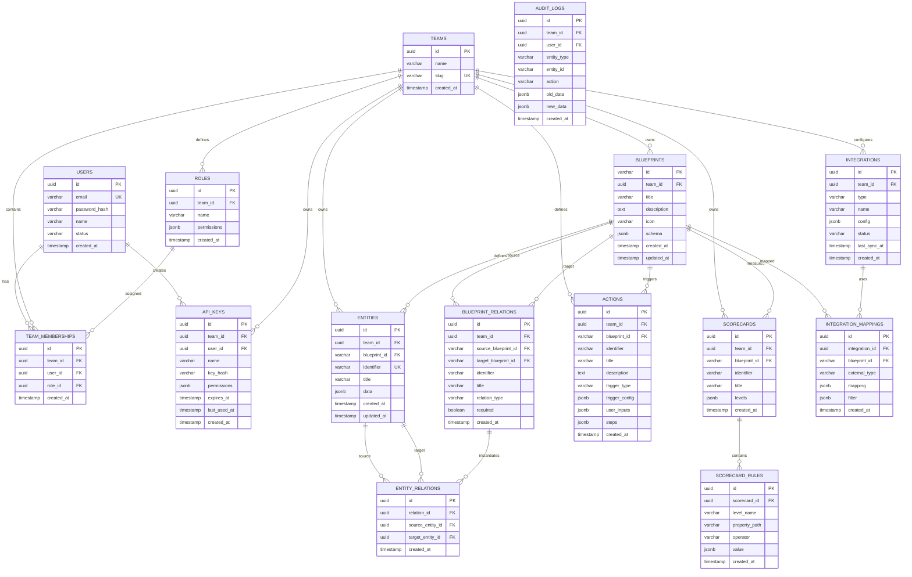
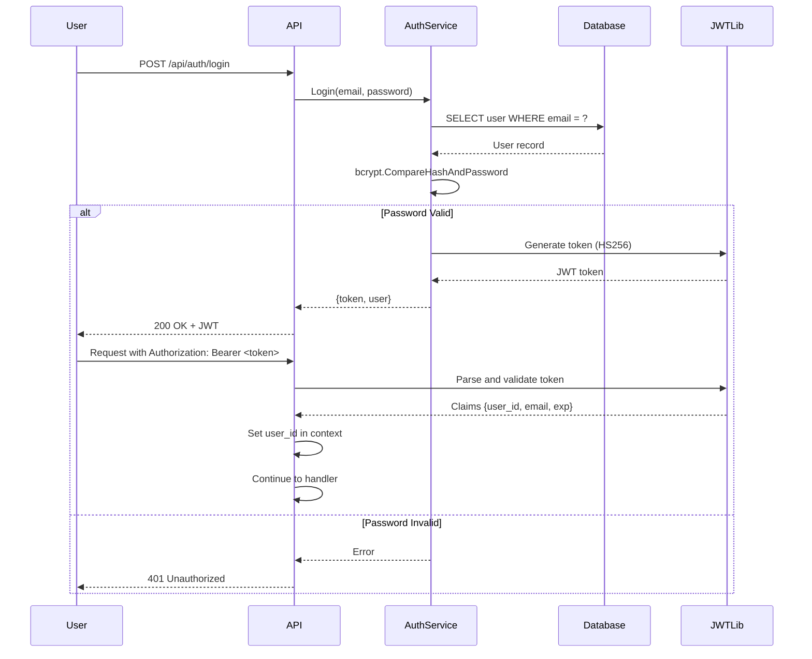
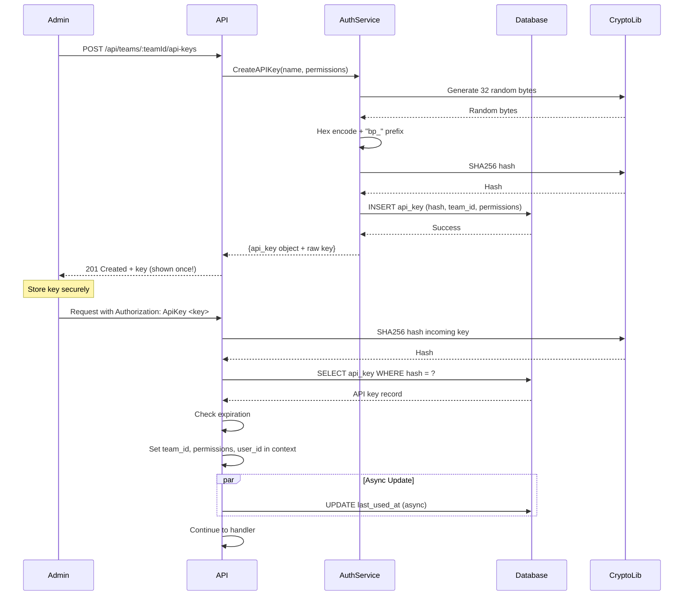
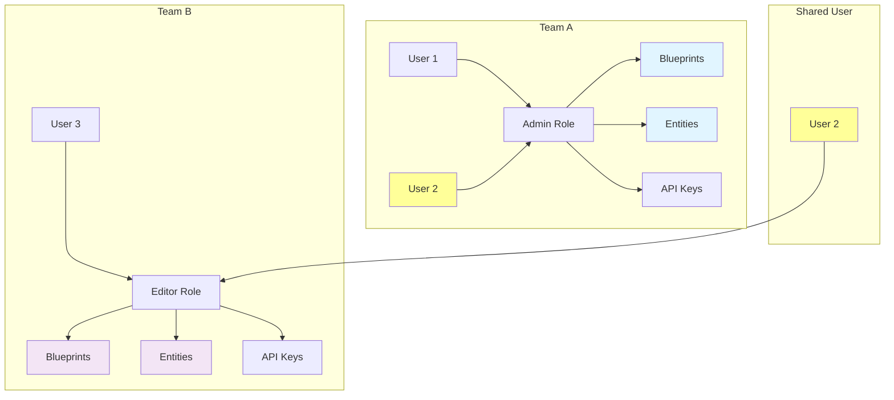
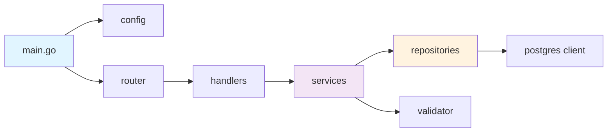
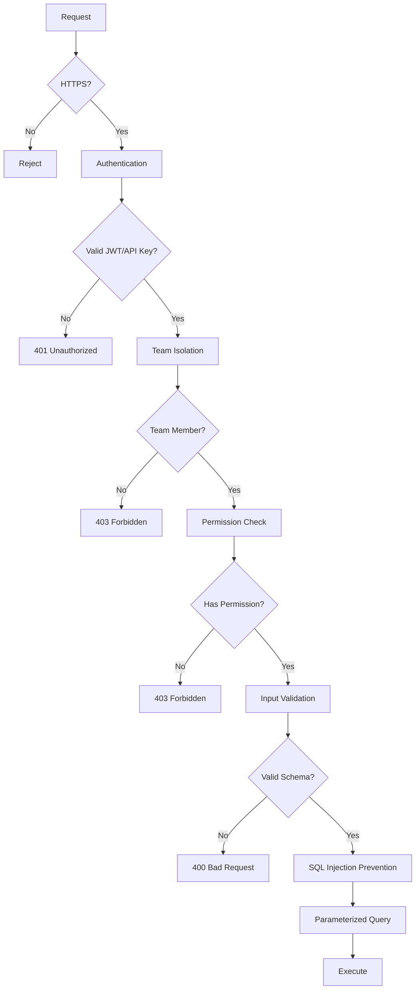

# Baseplate Architecture

Comprehensive technical architecture documentation for Baseplate - a headless backend engine with dynamic schema management.

## Table of Contents

- [System Overview](#system-overview)
- [Technology Stack](#technology-stack)
- [System Architecture](#system-architecture)
- [Request Flow](#request-flow)
- [Database Schema](#database-schema)
- [Authentication System](#authentication-system)
- [Multi-Tenancy](#multi-tenancy)
- [Component Details](#component-details)
- [Design Patterns](#design-patterns)

## System Overview

Baseplate is a production-ready headless backend engine inspired by Port.ai that enables dynamic schema management through "Blueprints". It eliminates the need for database migrations or code changes when defining new entity types, making it highly flexible for evolving data models.

**Key Capabilities**:
- Dynamic schema definition using JSON Schema
- Multi-tenant architecture with team-based isolation
- Comprehensive RBAC (Role-Based Access Control)
- Dual authentication (JWT tokens and API keys)
- Advanced entity search with JSONB queries
- RESTful API with 28 endpoints

## Technology Stack

**Core Technologies**:
- **Language**: Go 1.25.1
- **Web Framework**: Gin v1.11.0
- **Database**: PostgreSQL 15 with JSONB support
- **Authentication**: JWT (golang-jwt/jwt/v5) + API Keys
- **Password Hashing**: bcrypt (golang.org/x/crypto)
- **JSON Schema Validation**: gojsonschema v1.2.0
- **UUID Generation**: google/uuid v1.6.0

**Infrastructure**:
- **Containerization**: Docker with docker-compose
- **Database Driver**: lib/pq v1.10.9

## System Architecture



## Request Flow

### Complete Request-Response Cycle



### Middleware Chain



## Database Schema

### Entity Relationship Diagram



### Key Indexes

**Performance Indexes**:
- `idx_entities_data` - GIN index on JSONB data for fast queries
- `idx_api_keys_hash` - Hash lookup for API key authentication
- `idx_team_memberships_user` - Fast user membership lookups
- `idx_team_memberships_team` - Fast team member listings

**Relationship Indexes**:
- `idx_entities_blueprint` - Entity filtering by blueprint
- `idx_entity_relations_source/target` - Relationship traversal
- `idx_scorecards_blueprint` - Scorecard lookups

**Cascade Behavior**:
- Deleting a team cascades to all team resources (blueprints, entities, roles, etc.)
- Deleting a user cascades to memberships, sets API keys' user_id to NULL
- Deleting a blueprint cascades to entities and relations

## Authentication System

### JWT Token Flow



**JWT Properties**:
- Algorithm: HS256 (HMAC-SHA256)
- Secret: From `JWT_SECRET` environment variable
- Expiration: 24 hours (configurable)
- Claims: `user_id`, `email`, `issued_at`, `expires_at`
- Location: `internal/core/auth/service.go`

### API Key Flow



**API Key Properties**:
- Format: `bp_<64_hex_characters>`
- Storage: SHA-256 hash in database
- Team-scoped with optional permissions
- Optional expiration timestamp
- Async last-used tracking
- Location: `internal/core/auth/service.go:325-384`

### Password Security

- **Algorithm**: bcrypt with default cost (10)
- **Salt**: Automatically generated per password
- **Storage**: In `users.password_hash` column
- **Validation**: `bcrypt.CompareHashAndPassword`
- **Location**: `internal/core/auth/service.go`

## Multi-Tenancy

### Team Isolation Model



**Isolation Guarantees**:
1. All resources (blueprints, entities, roles) scoped to `team_id`
2. Users can belong to multiple teams with different roles
3. API keys are team-specific
4. Database queries always filter by `team_id`
5. Middleware enforces team membership before access

**Team Context Resolution Order**:
1. API Key → Automatic from key's team association
2. URL Parameter → `/teams/:teamId/...`
3. Header → `X-Team-ID: <uuid>`

## Component Details

### Layer Responsibilities

| Layer | Location | Responsibilities | Rules |
|-------|----------|-----------------|-------|
| **Handlers** | `internal/api/handlers/` | - HTTP request/response binding<br>- Input validation<br>- Response formatting<br>- Error handling | - No business logic<br>- No database access<br>- Thin layer |
| **Services** | `internal/core/*/service.go` | - Business logic orchestration<br>- Cross-domain operations<br>- Validation coordination<br>- Transaction management | - No HTTP concerns<br>- Testable without HTTP<br>- Core domain logic |
| **Repositories** | `internal/core/*/repository.go` | - SQL query execution<br>- Data mapping (SQL ↔ Go)<br>- JSONB operations<br>- Query optimization | - No business logic<br>- Pure data access<br>- SQL expertise |
| **Validation** | `internal/core/validation/` | - JSON Schema validation<br>- Full and partial validation<br>- Error reporting | - Schema-driven<br>- Framework-agnostic |

### Package Structure

```
internal/
├── api/
│   ├── router.go                 # Route setup, middleware chain
│   ├── handlers/
│   │   ├── auth.go              # Auth endpoints (3)
│   │   ├── team.go              # Team/role/member/API key (11)
│   │   ├── blueprint.go         # Blueprint CRUD (5)
│   │   └── entity.go            # Entity CRUD + search (8)
│   └── middleware/
│       ├── auth.go              # JWT/API key auth + RBAC
│       └── error.go             # Global error handling
├── core/
│   ├── auth/
│   │   ├── models.go            # User, Team, Role, APIKey
│   │   ├── service.go           # Auth business logic
│   │   └── repository.go        # Auth data access
│   ├── blueprint/
│   │   ├── models.go            # Blueprint structs
│   │   ├── service.go           # Blueprint business logic
│   │   └── repository.go        # Blueprint data access
│   ├── entity/
│   │   ├── models.go            # Entity, SearchRequest
│   │   ├── service.go           # Entity business logic
│   │   └── repository.go        # Entity data access + search
│   └── validation/
│       └── validator.go         # JSON Schema validator
└── storage/
    └── postgres/
        └── client.go            # Database connection
```

### Dependency Flow



**Key Dependencies**:
- Services depend on repositories
- Entity service depends on blueprint service
- Entity service depends on validator
- No circular dependencies

## Design Patterns

### 1. Repository Pattern

Separates data access logic from business logic.

```go
// Service uses repository interface
type EntityService struct {
    repo EntityRepository
    blueprintService *blueprint.Service
    validator *validation.Validator
}

// Repository implements data access
type EntityRepository interface {
    Create(ctx context.Context, entity *Entity) error
    GetByID(ctx context.Context, id uuid.UUID) (*Entity, error)
    // ...
}
```

### 2. Service Layer

Encapsulates business logic, coordinates between repositories.

```go
func (s *EntityService) Create(ctx context.Context, req *CreateEntityRequest) (*Entity, error) {
    // 1. Fetch blueprint schema
    blueprint := s.blueprintService.GetByID(req.BlueprintID)

    // 2. Validate against schema
    if err := s.validator.Validate(req.Data, blueprint.Schema); err != nil {
        return nil, err
    }

    // 3. Save to database
    return s.repo.Create(ctx, entity)
}
```

### 3. Dependency Injection

Constructor-based injection for testability.

```go
func NewEntityService(repo EntityRepository,
                      blueprintService *blueprint.Service,
                      validator *validation.Validator) *EntityService {
    return &EntityService{
        repo: repo,
        blueprintService: blueprintService,
        validator: validator,
    }
}
```

### 4. Middleware Chain

Composable request processing pipeline.

```go
router.Use(
    gin.Recovery(),
    gin.Logger(),
    middleware.ErrorHandler(),
    middleware.Authenticate(),
    middleware.RequireTeam(),
    middleware.RequirePermission("entity:write"),
)
```

### 5. Context Passing

Request-scoped data via Gin context.

```go
// Middleware sets values
c.Set("user_id", userID)
c.Set("team_id", teamID)
c.Set("permissions", permissions)

// Handler retrieves values
userID := c.GetString("user_id")
teamID := c.GetString("team_id")
```

### 6. JSONB for Flexibility

Dynamic schema storage without migrations.

```go
// Blueprint defines schema
type Blueprint struct {
    Schema map[string]interface{} `json:"schema"`
}

// Entity stores validated data
type Entity struct {
    Data map[string]interface{} `json:"data"`
}

// PostgreSQL stores as JSONB
data JSONB NOT NULL DEFAULT '{}'
```

### 7. Strategy Pattern (Search Filters)

Dynamic SQL generation based on operator.

```go
switch filter.Operator {
case "eq":
    query += fmt.Sprintf("data->>'%s' = $%d", property, paramCount)
case "gt":
    query += fmt.Sprintf("(data->>'%s')::numeric > $%d", property, paramCount)
case "contains":
    query += fmt.Sprintf("data->>'%s' ILIKE $%d", property, paramCount)
}
```

## Security Architecture

### Security Layers



### Security Features

1. **Authentication**:
   - bcrypt password hashing (cost 10)
   - JWT with HS256 signing
   - API keys with SHA-256 hashing
   - Token expiration enforcement

2. **Authorization**:
   - RBAC with 13 permissions
   - Team-based isolation
   - Permission middleware
   - Default roles (admin, editor, viewer)

3. **Input Validation**:
   - JSON Schema validation
   - Property name regex: `^[a-zA-Z0-9_.]+$`
   - SQL injection prevention via parameterized queries
   - Order by column whitelist

4. **Data Protection**:
   - Team-scoped queries (multi-tenancy)
   - Cascade deletes for data consistency
   - API key hashing (never stored plain text)
   - Password never returned in responses

## Performance Considerations

### Database Optimizations

1. **Connection Pooling**:
   - MaxOpenConns: 25
   - MaxIdleConns: 5
   - ConnMaxLifetime: 5 minutes
   - ConnMaxIdleTime: 1 minute

2. **Indexes**:
   - GIN index on `entities.data` for JSONB queries
   - Standard B-tree indexes on foreign keys
   - Hash index on `api_keys.key_hash`
   - Composite unique indexes for constraints

3. **Query Optimization**:
   - Pagination support (limit/offset)
   - Count queries before fetch
   - Efficient JSONB path navigation
   - Prepared statement reuse

### Async Operations

**API Key Last Used Tracking**:
```go
go s.repo.UpdateAPIKeyLastUsed(context.Background(), apiKey.ID)
```

Runs in separate goroutine to avoid blocking request.

## Future Architecture

### Planned Features (Tables Defined)

1. **Relations System**:
   - Blueprint-level relation definitions
   - Entity-level relation instances
   - Support for many-to-many, one-to-many

2. **Scorecards**:
   - Quality/compliance metrics
   - Rule-based evaluation
   - Level-based scoring

3. **Integrations**:
   - External system connectors
   - Data synchronization
   - Field mapping

4. **Actions**:
   - Workflow automation
   - Manual and automatic triggers
   - Multi-step execution

5. **Audit Logging**:
   - Change tracking
   - User attribution
   - Historical data

---

For API documentation, see [API.md](./API.md).
For database details, see [DATABASE.md](./DATABASE.md).
For deployment instructions, see [DEPLOYMENT.md](./DEPLOYMENT.md).
