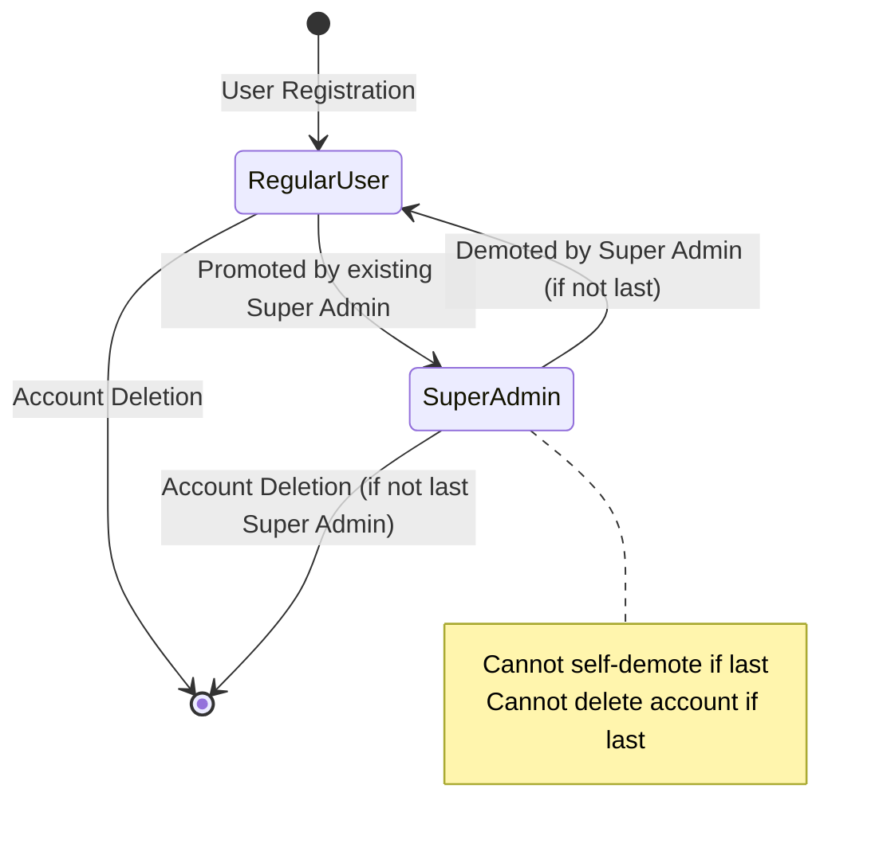

# Data Model: Super Admin Role

**Feature**: Super Admin Role
**Date**: 2026-01-12
**Phase**: 1 - Design

---

## Entity Changes

### User (Modified)

**Table**: `users`

**New Fields**:
| Field | Type | Constraints | Description |
|-------|------|-------------|-------------|
| `is_super_admin` | BOOLEAN | NOT NULL DEFAULT FALSE | Super admin designation flag |
| `super_admin_promoted_at` | TIMESTAMP WITH TIME ZONE | NULL | When user was promoted to super admin |
| `super_admin_promoted_by` | UUID | NULL, REFERENCES users(id) | Which super admin granted this status |

**Indexes**:
```sql
CREATE INDEX idx_users_super_admin ON users(is_super_admin)
  WHERE is_super_admin = true;
```

**Rationale**: Partial index optimizes super admin lookups (only indexes ~50 rows instead of 10000).

**Go Struct Update**:
```go
type User struct {
    ID                    uuid.UUID  `json:"id"`
    Email                 string     `json:"email"`
    PasswordHash          string     `json:"-"`
    Name                  string     `json:"name"`
    Status                string     `json:"status"`
    IsSuperAdmin          bool       `json:"is_super_admin"`
    SuperAdminPromotedAt  *time.Time `json:"super_admin_promoted_at,omitempty"`
    SuperAdminPromotedBy  *uuid.UUID `json:"super_admin_promoted_by,omitempty"`
    CreatedAt             time.Time  `json:"created_at"`
}
```

---

### JWTClaims (Modified)

**Go Struct**:
```go
type JWTClaims struct {
    UserID       uuid.UUID `json:"user_id"`
    Email        string    `json:"email"`
    IsSuperAdmin *bool     `json:"is_super_admin,omitempty"` // Pointer for graceful degradation
    jwt.RegisteredClaims
}
```

**Validation Rules**:
- `IsSuperAdmin` is optional in JWT for backward compatibility
- Missing claim defaults to `false`
- Claim value verified via JWT signature (cannot be forged by client)

---

### AuditLog (Modified)

**Table**: `audit_logs`

**New Fields**:
| Field | Type | Constraints | Description |
|-------|------|-------------|-------------|
| `actor_type` | VARCHAR(20) | NOT NULL DEFAULT 'team_member', CHECK(actor_type IN ('team_member', 'super_admin', 'api_key')) | Discriminator for actor type |
| `ip_address` | INET | NULL | Client IP address |
| `user_agent` | TEXT | NULL | Client user agent string |
| `result_status` | VARCHAR(20) | NULL, CHECK(result_status IN ('success', 'failure', 'partial')) | Operation outcome |
| `request_context` | JSONB | NOT NULL DEFAULT '{}' | Full request context (headers, params) |

**Existing Fields** (for reference):
| Field | Type | Description |
|-------|------|-------------|
| `id` | UUID | Primary key |
| `team_id` | UUID | Team context (NULL for super admin cross-team actions) |
| `user_id` | UUID | Actor performing action |
| `entity_type` | VARCHAR(50) | Target entity type |
| `entity_id` | VARCHAR(255) | Target entity ID |
| `action` | VARCHAR(20) | Action type (create, read, update, delete, promote, demote) |
| `old_data` | JSONB | State before modification (before snapshot) |
| `new_data` | JSONB | State after modification (after snapshot) |
| `created_at` | TIMESTAMP | When action occurred |

**New Indexes**:
```sql
CREATE INDEX idx_audit_logs_actor_type ON audit_logs(actor_type)
  WHERE actor_type = 'super_admin';
```

**Rationale**: Partial index optimizes super admin audit queries without bloating index for team member actions.

**Go Struct Update**:
```go
type AuditLog struct {
    ID             uuid.UUID         `json:"id"`
    TeamID         *uuid.UUID        `json:"team_id,omitempty"`
    UserID         *uuid.UUID        `json:"user_id,omitempty"`
    ActorType      string            `json:"actor_type"` // NEW
    EntityType     string            `json:"entity_type"`
    EntityID       string            `json:"entity_id"`
    Action         string            `json:"action"`
    OldData        map[string]any    `json:"old_data,omitempty"`
    NewData        map[string]any    `json:"new_data,omitempty"`
    IPAddress      *string           `json:"ip_address,omitempty"` // NEW
    UserAgent      *string           `json:"user_agent,omitempty"` // NEW
    ResultStatus   *string           `json:"result_status,omitempty"` // NEW
    RequestContext map[string]any    `json:"request_context,omitempty"` // NEW
    CreatedAt      time.Time         `json:"created_at"`
}
```

---

## State Transitions

### Super Admin Lifecycle



### Promotion Process

**Preconditions**:
- Actor must have `is_super_admin = true`
- Target user must exist and have `status = 'active'`

**Atomic Operation** (in transaction):
1. Verify actor is super admin
2. Update target user: `SET is_super_admin = true, super_admin_promoted_at = NOW(), super_admin_promoted_by = actor_id`
3. Extend JWT claims on next login
4. Log promotion in audit_logs with `actor_type = 'super_admin'`, `action = 'promote'`

**Postconditions**:
- Target user gains platform-wide access
- Target user's next JWT includes `is_super_admin = true`
- Audit trail records promotion

### Demotion Process

**Preconditions**:
- Actor must have `is_super_admin = true`
- Target user must exist and have `is_super_admin = true`
- Target cannot be last super admin (enforced via SELECT FOR UPDATE)

**Atomic Operation** (in transaction):
1. Begin transaction with isolation level READ COMMITTED
2. Execute `SELECT COUNT(*) FROM users WHERE is_super_admin = true FOR UPDATE`
3. If count <= 1 AND target = actor: abort with `ErrLastSuperAdmin`
4. Update target user: `SET is_super_admin = false, super_admin_promoted_at = NULL, super_admin_promoted_by = NULL`
5. Commit transaction
6. Log demotion in audit_logs with `actor_type = 'super_admin'`, `action = 'demote'`

**Postconditions**:
- Target user loses platform-wide access
- Target user's next JWT excludes `is_super_admin` claim (or sets to false)
- Target user retains team-level roles and permissions

### Account Deletion (Super Admin)

**Preconditions**:
- Actor must be authenticated
- Actor must own the account being deleted OR actor must be super admin
- If target is super admin: target cannot be last super admin

**Atomic Operation** (in transaction):
1. Begin transaction
2. If target is super admin: `SELECT COUNT(*) FROM users WHERE is_super_admin = true FOR UPDATE`
3. If count <= 1: abort with `ErrLastSuperAdmin`
4. Soft delete: `UPDATE users SET status = 'deleted' WHERE id = target_id`
5. Commit transaction
6. Log deletion in audit_logs

**Postconditions**:
- User status changed to 'deleted'
- User cannot log in (JWT validation fails)
- Audit trail records deletion

---

## Validation Rules

### Super Admin Promotion

| Rule | Validation | Error |
|------|------------|-------|
| VR-001 | Actor must be super admin | `ErrUnauthorized` (403) |
| VR-002 | Target user must exist | `ErrNotFound` (404) |
| VR-003 | Target user must be active | `ErrInvalidStatus` (400) |
| VR-004 | Target cannot already be super admin | `ErrAlreadySuperAdmin` (400) |

### Super Admin Demotion

| Rule | Validation | Error |
|------|------------|-------|
| VR-005 | Actor must be super admin | `ErrUnauthorized` (403) |
| VR-006 | Target user must exist | `ErrNotFound` (404) |
| VR-007 | Target must be super admin | `ErrNotSuperAdmin` (400) |
| VR-008 | Target cannot be last super admin | `ErrLastSuperAdmin` (409) |

### Account Deletion

| Rule | Validation | Error |
|------|------------|-------|
| VR-009 | Actor must own account OR be super admin | `ErrUnauthorized` (403) |
| VR-010 | If target is super admin, cannot be last | `ErrLastSuperAdmin` (409) |

---

## Database Migration

**File**: `migrations/002_super_admin.sql`

```sql
-- Add super admin fields to users table
ALTER TABLE users ADD COLUMN is_super_admin BOOLEAN NOT NULL DEFAULT FALSE;
ALTER TABLE users ADD COLUMN super_admin_promoted_at TIMESTAMP WITH TIME ZONE;
ALTER TABLE users ADD COLUMN super_admin_promoted_by UUID REFERENCES users(id) ON DELETE SET NULL;

-- Add partial index for super admin lookups
CREATE INDEX idx_users_super_admin ON users(is_super_admin)
  WHERE is_super_admin = true;

-- Extend audit_logs table for detailed super admin auditing
ALTER TABLE audit_logs ADD COLUMN actor_type VARCHAR(20) NOT NULL DEFAULT 'team_member'
  CHECK (actor_type IN ('team_member', 'super_admin', 'api_key'));
ALTER TABLE audit_logs ADD COLUMN ip_address INET;
ALTER TABLE audit_logs ADD COLUMN user_agent TEXT;
ALTER TABLE audit_logs ADD COLUMN result_status VARCHAR(20)
  CHECK (result_status IN ('success', 'failure', 'partial'));
ALTER TABLE audit_logs ADD COLUMN request_context JSONB NOT NULL DEFAULT '{}';

-- Add partial index for super admin audit queries
CREATE INDEX idx_audit_logs_actor_type ON audit_logs(actor_type)
  WHERE actor_type = 'super_admin';

-- Note: Initial super admin creation handled by /cmd/init-superadmin tool
-- Requires environment variables: SUPER_ADMIN_EMAIL, SUPER_ADMIN_PASSWORD
```

---

## Relationships

### User → User (Super Admin Promotion)

**Type**: Self-referential one-to-many

**Description**: Tracks which super admin promoted another user to super admin status.

**Cardinality**:
- One super admin can promote many users (1:N)
- Each promoted super admin has zero or one promoter (initial super admin has NULL)

**Constraint**: `FOREIGN KEY (super_admin_promoted_by) REFERENCES users(id) ON DELETE SET NULL`

**Rationale**: ON DELETE SET NULL preserves audit trail even if promoter account is deleted.

### AuditLog → User (Actor)

**Type**: Many-to-one

**Description**: Links audit log entry to the user who performed the action.

**Cardinality**: Many audit entries per user

**Constraint**: `FOREIGN KEY (user_id) REFERENCES users(id) ON DELETE SET NULL`

**Rationale**: Preserve audit trail even if user deleted.

### AuditLog → Team (Context)

**Type**: Many-to-one (optional)

**Description**: Links audit log entry to team context. NULL for super admin cross-team actions.

**Cardinality**: Many audit entries per team, some entries have NULL team_id

**Constraint**: `FOREIGN KEY (team_id) REFERENCES teams(id) ON DELETE SET NULL`

---

## Data Integrity Constraints

### Database-Level Constraints

1. **Super Admin Boolean**: `is_super_admin BOOLEAN NOT NULL DEFAULT FALSE`
   - Prevents NULL values
   - Defaults to FALSE for safety

2. **Actor Type Check**: `CHECK (actor_type IN ('team_member', 'super_admin', 'api_key'))`
   - Enforces valid actor types
   - Prevents typos/invalid values

3. **Result Status Check**: `CHECK (result_status IN ('success', 'failure', 'partial'))`
   - Enforces valid status values

4. **Foreign Key Cascade**: `ON DELETE SET NULL` for audit logs
   - Preserves audit trail integrity

### Application-Level Constraints

1. **Last Super Admin Protection** (Service Layer):
   - Enforced via transaction with `SELECT FOR UPDATE`
   - Prevents race conditions

2. **Privilege Escalation Prevention** (Middleware):
   - Only existing super admins can promote
   - JWT signature validation prevents claim forgery

3. **JWT Claim Validation** (Auth Service):
   - Missing `is_super_admin` claim defaults to FALSE
   - Graceful degradation for old tokens

---

## Performance Considerations

### Query Optimization

**Super Admin Count** (for last admin check):
```sql
SELECT COUNT(*) FROM users WHERE is_super_admin = true FOR UPDATE;
```
- Uses partial index `idx_users_super_admin`
- Expected rows: ~50
- Estimated time: <5ms
- Lock contention: Low (rare operation)

**Super Admin Audit Query**:
```sql
SELECT * FROM audit_logs
WHERE actor_type = 'super_admin'
  AND created_at > NOW() - INTERVAL '7 days'
ORDER BY created_at DESC
LIMIT 100;
```
- Uses partial index `idx_audit_logs_actor_type` + `idx_audit_logs_created`
- Expected rows: <1000 for 7-day window
- Estimated time: <50ms

### Index Sizes

- `idx_users_super_admin`: ~50 rows × 5 bytes = 250 bytes (negligible)
- `idx_audit_logs_actor_type`: ~5% of audit entries (~500 rows) × 25 bytes = ~12 KB

### Storage Impact

- Per user: +9 bytes (1 boolean + 8 timestamp) + optional UUID reference (16 bytes if set)
- Per audit log: +~100 bytes (actor_type, ip_address, user_agent, result_status, request_context)
- Total for 10K users + 100K audit logs: ~10 MB additional storage (negligible)

---

## Next Steps

1. Generate OpenAPI contract in `contracts/super-admin-api.yaml`
2. Create `quickstart.md` for local development testing
3. Update agent context with data model decisions
